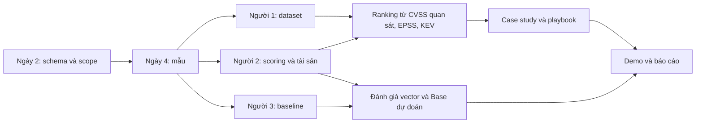

# T08 — Lộ trình 30 ngày cho nhóm 3 người

> Lập ngày 27/09/2026 theo góp ý của giảng viên. Ngày 1–30 là **ngày lịch tính từ lúc nhóm bắt đầu**, không phải 30 ngày làm việc. Chốt ngày nộp thật ở Phase 0; nếu còn 28–29 ngày thì rút phần dự phòng tương ứng.
>
> Đây là kế hoạch triển khai. Đường dẫn “tạo mới”, hàm và lệnh dự kiến trong các phase **chưa phải tính năng đã hoàn thành**.

## 1. Mở file nào để bắt đầu?

Mỗi phase có nhiệm vụ cho cả ba người, file cần sửa/tạo, chức năng, đầu vào–đầu ra, prompt vibe code, kiểm tra và điều kiện bàn giao.

| Phase | Ngày | Hướng dẫn | Đầu ra chính |
|---|---|---|---|
| 0 | 1–2 | [Phạm vi và thiết kế](phases/phase-0-pham-vi-va-thiet-ke.md) | Phạm vi Web/mobile, schema, lịch, phân vai |
| 1 | 3–7 | [Dữ liệu Web/mobile](phases/phase-1-du-lieu-web-mobile.md) | Mẫu sớm; dataset NVD + EPSS + KEV có nguồn/snapshot |
| 2 | 8–13 | [Mô hình NLP](phases/phase-2-mo-hinh-nlp.md) | Baseline đánh giá được, bộ tính CVSS, ranking sơ bộ |
| 3 | 14–20 | [Xếp hạng và bối cảnh](phases/phase-3-xep-hang-va-boi-canh.md) | Top-50, biểu đồ, 3–5 case study, context và playbook |
| 4 | 21–25 | [Tích hợp và demo](phases/phase-4-tich-hop-va-demo.md) | Demo local, hướng dẫn tái lập, chạy trên máy thứ hai |
| 5 | 26–30 | [Báo cáo và bảo vệ](phases/phase-5-bao-cao-va-bao-ve.md) | Báo cáo, slide, demo dự phòng; ngày 29–30 sửa lỗi/nộp |

Tên cột và quy tắc bàn giao nằm trong [data_contract.md](data_contract.md). Nếu một ví dụ trong phase khác schema, sửa ví dụ theo contract trước khi code. Thay contract phải báo cả nhóm.

Quy tắc chia branch, commit, push và review được chốt tại [06-git-workflow.md](06-git-workflow.md). Mỗi task trong phase dùng một branch ngắn, mở PR vào `develop`; `main` dành cho bản demo/nộp đã nghiệm thu.

## 2. Chuyển lời thầy thành định hướng thực hiện

**Câu hỏi chính:** với các lỗ hổng liên quan Web và ứng dụng di động, vì sao sắp giảm dần CVSS có thể cho thứ tự vá chưa phù hợp, và khi thêm EPSS, KEV, bối cảnh tài sản thì quyết định thay đổi thế nào?

AI phục vụ bài toán con: ước lượng tám thành phần CVSS từ mô tả, rồi kiểm tra sai số. Dự đoán CVSS tốt không tự chứng minh mô hình biết lỗ hổng nào cần vá trước. CVSS mô tả mức nghiêm trọng và cần phân tích bối cảnh khi đánh giá rủi ro. [FIRST — CVSS v3.1 User Guide](https://www.first.org/cvss/v3.1/user-guide).

EPSS ước tính khả năng một CVE được khai thác ngoài thực tế trong 30 ngày tới, không phải xác suất riêng cho hệ thống giả định. KEV cung cấp bằng chứng đã biết về khai thác; không có tên trong catalog chưa đủ kết luận CVE an toàn. [FIRST — EPSS](https://www.first.org/epss/), [CISA — KEV Catalog](https://www.cisa.gov/known-exploited-vulnerabilities-catalog).

Không cần mở thêm đề tài SQLi, fuzzing hoặc phân tích tĩnh: ví dụ của thầy giải thích vai trò của phương pháp. Nhóm vẫn làm T08, không khai thác CVE. Tải dữ liệu NVD không phải black-box scanning; sản phẩm không phải báo cáo pentest đã thực hiện.

**Chưa có Đề cương môn học trong repo đã kiểm tra.** Người 1 đối chiếu đề cương thật trong ngày 1. Tỷ lệ, số lượng và phạm vi tùy chọn dưới đây là đề xuất của kế hoạch, không phải rubric của giảng viên.

Đề xuất nội dung báo cáo/thuyết trình: **65% phân tích bảo mật, 25% NLP, 10% dữ liệu và tái lập**.

## 3. Phạm vi vừa đủ cho một tháng

### Kịch bản xuyên suốt

Một hệ thống thương mại điện tử giả định gồm website, API dùng chung Web/mobile, trang quản trị, mobile client, dịch vụ lưu dữ liệu nghiệp vụ và một bản triển khai đối chứng. Khoảng 5–6 tài sản logic là đủ; không phải code một ứng dụng thương mại điện tử.

Người 2 chọn sản phẩm/phiên bản cụ thể sau khi kiểm tra advisory. Có ít nhất một case Web và một case ảnh hưởng trực tiếp đến mobile client/framework/SDK/thành phần di động. API được app sử dụng thuộc bề mặt API; chỉ điều đó chưa đủ đại diện cho bảo mật phía mobile.

Không gán CVE cho sản phẩm không bị ảnh hưởng để có đủ ví dụ. Một CVE trên hai môi trường chỉ được dùng khi cả hai thật sự phù hợp với điều kiện ảnh hưởng đã giả định.

### Các tập dữ liệu riêng

| Tập | Mục đích | Quy mô định hướng, chưa phải số liệu thực tế |
|---|---|---|
| Master NVD | Giữ dữ liệu nguồn, cả CVE thiếu nhãn | Thử khoảng công bố 2023–2024; tải từng khoảng nhỏ |
| NLP | Mô tả → CVSS v3.1 | Ưu tiên Web/mobile; nếu ít có thể dùng tập nền rộng hơn và báo Web/mobile riêng |
| Ranking chính | So cùng cohort Web/mobile có CVSS/EPSS/KEV hợp lệ | Mục tiêu ≥200 CVE; phải lớn hơn 50 để top-50 có tính chọn lọc |
| Context | Ánh xạ CVE vào tài sản có căn cứ | Khoảng 10–20 cặp CVE–tài sản, phân tích sâu 3–5 case |

Không chọn cohort theo KEV/EPSS cao hoặc kết luận mong muốn. Nếu thiếu mẫu, mở rộng khoảng năm/sản phẩm theo quy tắc được ghi lại. Nếu N ≤ 50, báo top-K nhỏ hơn N và giới hạn chưa đạt top-50 có ý nghĩa; không nhân bản dòng.

### Ba cách sắp xếp cho sản phẩm top-50

1. **CVSS-first:** CVSS Base giảm dần; hòa thì CVE ID tăng dần.
2. **EPSS-first:** EPSS giảm dần; hòa thì CVE ID tăng dần.
3. **KEV-first:** thuộc KEV trước, rồi EPSS giảm dần, CVSS giảm dần, CVE ID tăng dần.

KEV là trạng thái catalog, **không phải thang điểm số**. Cột thứ ba là chính sách tham chiếu của nhóm để trình bày ba danh sách theo đề tài. Dùng độ bao phủ KEV để đối chiếu CVSS-first/EPSS-first tại snapshot; không lấy recall của KEV-first làm bằng chứng dự báo độc lập.

Bảng ưu tiên theo tài sản trình bày riêng vì đơn vị là cặp CVE–tài sản. Environmental vẫn là severity theo môi trường, không phải xác suất khai thác hay thang rủi ro toàn diện.

## 4. Vai trò và ngân sách thời gian

Chưa có tên thật/năng lực từng người nên giữ Người 1–3 như kế hoạch trước. Mỗi task có một người chính và reviewer.

| Người | Trách nhiệm | Phạm vi sở hữu | Reviewer |
|---|---|---|---|
| **1 — Data, tích hợp, nhóm trưởng** | Thu thập/làm sạch, kiểm tra dataset, điều phối, tái lập | `src/collect/`, config dự án, metadata, EDA, runbook, bản nộp | N3 kiểm nhãn; N2 kiểm scope/snapshot |
| **2 — Phân tích bảo mật** | Case Web/mobile, CVSS, ranking, context, playbook | `src/environmental/`, `src/analysis/`, config tài sản, docs bảo mật | N1 kiểm số liệu; N3 kiểm đầu ra |
| **3 — NLP và demo** | Baseline, đánh giá, transformer có giới hạn, demo artifact | `src/model/`, config model, notebook đánh giá, app tùy chọn | N1 kiểm tái lập; N2 kiểm diễn giải |

Người 2 không phải tự làm hết nghiên cứu: N1 hỗ trợ số liệu/EDA và một case; N3 hỗ trợ biểu đồ theo review của N2, case mobile và lỗi dự đoán. Cả ba viết báo cáo và hiểu kết luận bảo mật.

| Phase | Giờ N1 | Giờ N2 | Giờ N3 |
|---|---:|---:|---:|
| 0 | 4 | 4 | 4 |
| 1 | 12 | 12 | 12 |
| 2 | 14 | 14 | 14 |
| 3 | 16 | 16 | 16 |
| 4 | 8 | 8 | 8 |
| 5 | 6 | 6 | 6 |
| **Tổng** | **60** | **60** | **60** |

Khoảng 180 giờ tập trung cho nhóm, tương đương 2–3 giờ/người ở phần lớn ngày hoạt động. Thời gian máy tự tải/train không tính toàn bộ vào giờ người làm. Đây là dự toán, không phải bảo đảm mọi cấu hình đều đủ. Nếu chỉ có 30 giờ/người, cắt phần tùy chọn ngay ngày 2. Ngày 7 và 13 rà lại khối lượng.

## 5. Hiện trạng repo và các điều phải sửa

| Hạng mục | Hiện trạng lúc lập kế hoạch | Hướng xử lý |
|---|---|---|
| `explore_apis.py` | Có code khám phá ba nguồn; chưa chạy xác minh trong lần lập kế hoạch này | Dùng tham khảo schema, chưa xem là pipeline hoàn chỉnh |
| Collector/model/environmental/analysis khác | Chủ yếu docstring/TODO | Triển khai thật; “chạy không lỗi” chưa đủ |
| Docs 01–04 | Có khung và nhận định cần chỉnh | Phase 0–3 phân công rà/sửa trước khi đưa vào báo cáo |
| Notebook/test nghiệp vụ | Chưa có bản hoàn chỉnh | Tạo kiểm tra rủi ro chính và notebook đánh giá |
| Config, reports, module mới, app | Chưa triển khai | Tạo theo task; phân biệt bắt buộc/tùy chọn |
| README | Có lệnh gọi hai file chưa tồn tại | Dùng `cvss_environmental.py`, `plots.py`; chốt CLI khi đã chạy được |

Các cách làm chưa phù hợp trong nội dung cũ cần được sửa: bỏ CVE thiếu CVSS khỏi master; dùng EPSS khác ngày cho từng dòng trong snapshot; mặc định nguồn ngoài NVD đều là CNA; đổi MAV chỉ vì nội bộ/WAF; KEV override trước kiểm tra ảnh hưởng; kết luận “vá lãng phí” chỉ từ EPSS thấp. Chi tiết giao việc ở Phase 0–3.

[Bản kế hoạch trước](archive/05-ke-hoach-phan-cong-ban-cu.md) được giữ nguyên để tham khảo. Dùng lịch/phạm vi ở bộ phase mới; EC2, Docker bắt buộc, dashboard đầy đủ và 30–50 case context trong bản cũ không còn là điều kiện của kế hoạch này.

## 6. Mốc bàn giao và làm việc song song



| Hạn | Ai giao → ai nhận | Bằng chứng | Nếu chậm |
|---|---|---|---|
| Ngày 2 | Cả nhóm | Contract v0.1, scope, split dự kiến | Chốt phần tối thiểu trước thêm tính năng |
| Ngày 4 | N1 → N2/N3 | Mẫu thật cùng metadata, đọc được trên hai máy | Mẫu nhỏ hơn; fixture tách khỏi dữ liệu nghiên cứu |
| Ngày 7 | N1 → cả nhóm | Dataset v1, EDA, số mẫu mỗi cohort/split | Mở rộng có kiểm soát; không giấu missing |
| Ngày 8 | N2 → N3 | Hàm Base Score kiểm chứng được | N3 đo F1 trước, score chờ hàm đúng |
| Ngày 13 | N3/N2 → nhóm | Baseline metrics/prediction; ranking sơ bộ | Dừng transformer, dùng baseline |
| Ngày 20 | Cả nhóm | Hình, bảng, case, playbook, nháp báo cáo | Dừng UI mới |
| Ngày 25 | N1/N3 → N2 | Demo local chạy trên máy thứ hai | Notebook/CLI và hình/video dự phòng |
| Ngày 28 | Cả nhóm | Bản nộp đóng băng | Ngày 29–30 chỉ sửa lỗi chặn nộp |

Phân tích chính dùng CVSS quan sát được nên không chờ AI train xong. Prediction là thí nghiệm bổ sung trên dữ liệu chưa dùng train, không ghi đè nhãn nguồn.

## 7. Quy tắc vibe code và review

1. Mỗi lần giao AI một file/hàm nhỏ, dùng prompt trong phase; đưa contract và file hiện tại làm ngữ cảnh.
2. Yêu cầu giữ tên cột, nêu input/output/lỗi, không bịa dữ liệu hoặc số liệu thực nghiệm.
3. Đọc diff và tự giải thích join, vector, split, ranking, missing trước khi chấp nhận code.
4. Kiểm tra những rủi ro thật: phân trang/join, thiếu dữ liệu, công thức CVSS, leakage, ties/top-K.
5. Chạy mẫu thật, mở output và đối chiếu một số dòng với nguồn. Fixture chỉ kiểm tra luồng.
6. Reviewer chạy lại/kiểm artifact; “Done” cần đầu ra và giải thích được.

AI hỗ trợ code/tóm tắt; người phụ trách kiểm chứng. Khai báo cách sử dụng công cụ AI theo yêu cầu học thuật của môn nếu có. Không nhờ AI điền F1, thứ hạng, CVE tiêu biểu hay ngày khai thác khi chưa có bằng chứng.

## 8. Giữ phần nào và cắt phần nào khi trễ?

| Mức | Phần việc |
|---|---|
| **Bắt buộc** | Cohort Web/mobile có bằng chứng; ba nguồn và provenance; NLP dự đoán 8 metric; đánh giá tách train/test; top-50/giới hạn nếu thiếu mẫu; phân tích bất đồng; context; playbook; báo cáo; tái lập local |
| **Nên làm nếu đủ giờ** | Một lượt DistilBERT cùng split; so baseline; sensitivity top-K/ngưỡng; Streamlit nhỏ |
| **Tùy chọn sau phần chính** | Docker, làm đẹp UI, một thí nghiệm model bổ sung |
| **Không lên lịch tháng này** | EC2/cloud, tài khoản/phân quyền app, khai thác CVE, fine-tune LLM lớn, tái tạo EPSS, xây hệ thống Web/mobile để khai thác |

“Tái lập” phải mô tả đúng mức: triển khai phương pháp NLP dự đoán vector là tối thiểu; chỉ nói tái lập chính xác bài báo khi khớp dữ liệu/split/kiến trúc/thiết lập gốc. DeepCVA dùng đầu vào cấp commit, nên chỉ tham khảo ý tưởng đa nhiệm nếu nhóm dùng mô tả CVE. N3 lập bảng đối chiếu phương pháp trong Phase 0/2. Nếu đề cương yêu cầu một kiến trúc cụ thể, đưa vào phần bắt buộc và cắt UI/Docker.

## 9. Theo dõi việc và nghiệm thu cuối tháng

Mỗi ngày cập nhật: đã xong / làm tiếp / vướng gì. Vướng hơn một buổi thì gửi mẫu/log cho reviewer. Họp 15–20 phút cuối phase để mở đầu ra thật.

```text
ID: P1-N1-03 | Owner: Người 1 | Reviewer: Người 3
Việc: ghép ba nguồn trong src/collect/build_dataset.py
Input: raw NVD/EPSS/KEV, contract v0.1
Output: cves.parquet + metadata
Hạn: ngày 7 | Dự toán: 3 giờ
Xong khi: không nhân dòng; đúng snapshot; N2/N3 đọc được
Trạng thái: TODO / Doing / Review / Done | Vướng: ...
```

- [ ] Cả ba giải thích được severity, likelihood, known exploitation và applicability.
- [ ] Có bằng chứng Web và mobile.
- [ ] Mỗi hình/bảng truy được cohort, snapshot, version và script.
- [ ] Có NLP tám metric và sai số thật; label nguồn/prediction tách biệt.
- [ ] Ba danh sách top-50 dùng cùng cohort; KEV không bị biến thành điểm số/nhãn âm tuyệt đối.
- [ ] Có 3–5 case và phân tích thay đổi bối cảnh.
- [ ] Playbook kiểm tra ảnh hưởng trước, có hành động/người phụ trách/ngoại lệ.
- [ ] Không báo tiết kiệm chi phí, thời gian vá hoặc hiệu quả triển khai chưa đo.
- [ ] Báo cáo, slide, demo dùng cùng số liệu; chạy lại được local và có dự phòng.

**Buổi đầu:** N1 chốt lịch/schema, N2 chọn kiến trúc và phạm vi, N3 đọc phương pháp và thử baseline. Bắt đầu tại [Phase 0](phases/phase-0-pham-vi-va-thiet-ke.md).
